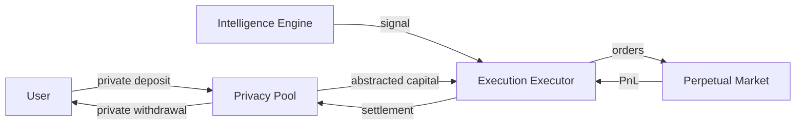
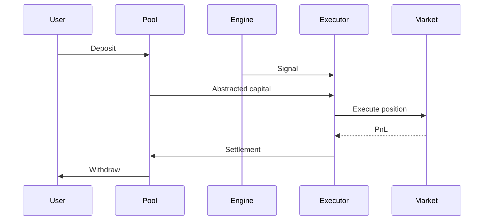

## Isolyn Core Architecture

This document describes the high-level architecture of Isolyn Core and
how intelligence, execution, and privacy components are composed while
preserving strict separation guarantees.

---

## Architectural Goals

Isolyn Core is designed around three primary goals:

### 1. Attribution Separation

No single component should be able to link user identity, capital origin,
execution behavior, and outcomes.

### 2. Minimal Trust Surface

Each component operates with the minimum information required to perform
its role.

### 3. Composable Execution

External systems can be integrated via adapters without modifying core
interfaces.

---

## High-Level System Overview

At a high level, Isolyn consists of three independent layers coordinated
by well-defined contracts:
	•	Intelligence Layer (analysis and signaling)
	•	Execution Layer (order placement and position management)
	•	Privacy Layer (capital abstraction and settlement)

No layer has full system context.

flowchart LR

---

## Layer Responsibilities

### Intelligence Layer

The intelligence layer is responsible for market analysis and signal
generation only.

**Responsibilities**
- analyze market structure and conditions
- produce directional signals (long or short)
- attach confidence or metadata to signals

**Constraints**
- no capital custody
- no transaction signing
- no access to user identity or addresses

External intelligence providers (e.g. large language models or
quantitative engines) are integrated via adapters that implement the
`Engine` interface.

---

### Execution Layer

The execution layer is responsible for placing and managing perpetual
positions.

**Responsibilities**
- receive directional signals
- place and close positions on external venues
- manage execution lifecycle

**Constraints**
- uses isolated, short-lived execution accounts
- no visibility into capital origin
- no access to user identity

Execution venues are integrated via adapters that implement the
`Executor` interface.

---

### Privacy Layer

The privacy layer abstracts capital movement and attribution.

**Responsibilities**
- accept pooled deposits
- fund execution without attribution
- settle execution outcomes
- enable private withdrawals

**Constraints**
- no linkage between deposits and execution
- no persistent address reuse
- no exposure of execution identifiers

Privacy systems are integrated via adapters that implement the `Pool`
interface.

---

## Adapter Model

Isolyn Core does not directly depend on external services.

External systems are integrated through adapters that implement core
interfaces:

- `Engine` → intelligence providers (e.g. Claude)
- `Executor` → execution venues (e.g. Hyperliquid)
- `Pool` → privacy systems (e.g. privacycash)

This design ensures that:
- vendors can be replaced without modifying core logic
- open-source code remains vendor-neutral
- sensitive integration logic can remain private

---

## Execution Lifecycle

The typical execution lifecycle follows these steps:

1. User deposits capital into the privacy pool
2. Intelligence engine evaluates market conditions
3. Execution layer receives a directional signal
4. Privacy pool provides abstracted execution capital
5. Execution places a position on the market
6. Execution settles outcomes back to the privacy pool
7. User withdraws privately

---

## Trust and Failure Model

Each layer is assumed to operate under adversarial conditions.

Failure or compromise of one layer must not:
	•	expose user identity
	•	expose capital origin
	•	enable custody of pooled funds

This is enforced by:
	•	strict interface boundaries
	•	minimal data propagation
	•	ephemeral execution identities

---

## Trust and Failure Model

Each layer is assumed to operate under adversarial conditions.

Failure or compromise of one layer must not:

- expose user identity
- expose capital origin
- enable custody of pooled funds

This is enforced by:

- strict interface boundaries
- minimal data propagation
- ephemeral execution identities

---

## Non-Goals

Isolyn Core explicitly does not attempt to:

- provide trading strategies
- optimize alpha generation
- manage user funds
- abstract market risk

These concerns are intentionally out of scope.

---

© Isolyn Labs
